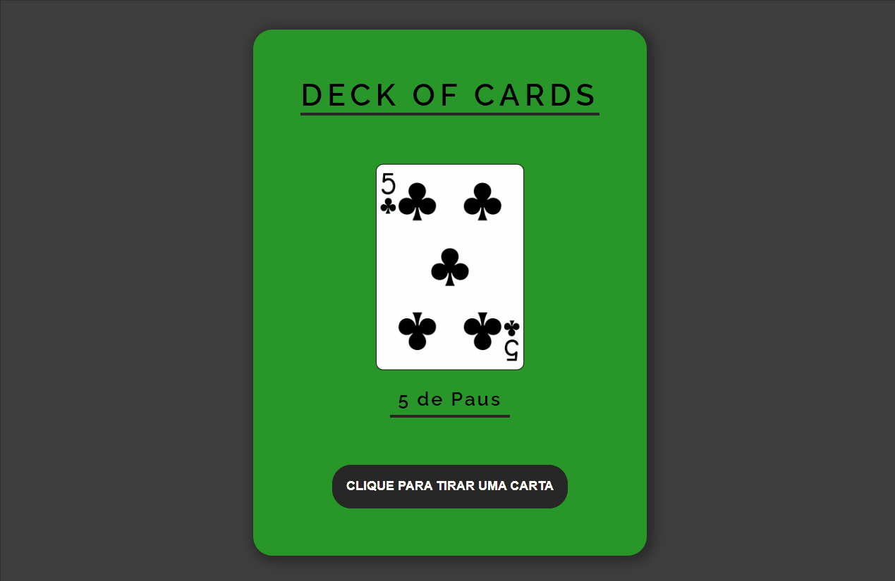

# Deck-of-cards

Este desafio, dentro do curso [Dev Quest](https://dev-em-dobro.ticto.club/), foi minha primeira experiência com o método fetch,
que nos permite fazer requisições para uma API e método JSON, que trafega os dados da API para nossa aplicação.

## Do que se trata esse desafio?
Trata-se de baralho de cartas embaralhadas, esse baralho é buscado na API pública [Deck of Cards](https://deckofcardsapi.com/).
Com essa API conseguimos criar o baralho e tirar cartas aleatórias.

## Quais interações são feitas?
- A cada clique do usuário no botão "CLIQUE PARA TIRAR UMA CARTA" uma carta aleatória é apresentada na tela.
- O valor e o nipe da carta aparecem escritos abaixo da imagem da carta.
  
## Habilidades desenvolvidas:
- Uso de flexbox para ajustes dos elementos na tela.
- Uso de animações @keyframes.
- Uso e manipulação dos elementos no JavaScript através do DOM.
- Uso e manipulação dos métodos Fetch e Json.
- Uso de funções assíncronas, eventos como addEventListener.
- Uso e manipulações de objetos, para a apresentação do nipe e valor da carta traduzidas para o português.
- Uso de mediaqueries para responsividade.

## Linguagens Utilizadas:
- HTML 

- CSS  

- JAVASCRIPT  
          

## Veja como ficou:

 

Para ver o projeto pronto, [CLIQUE AQUI!](https://jessica-os.github.io/Deck-of-cards/)
